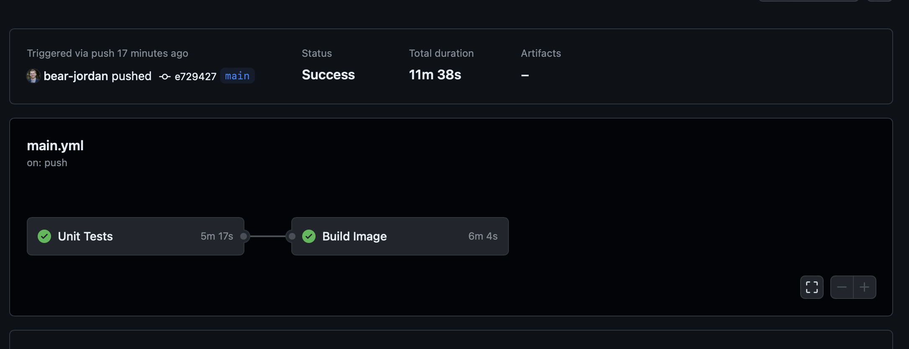
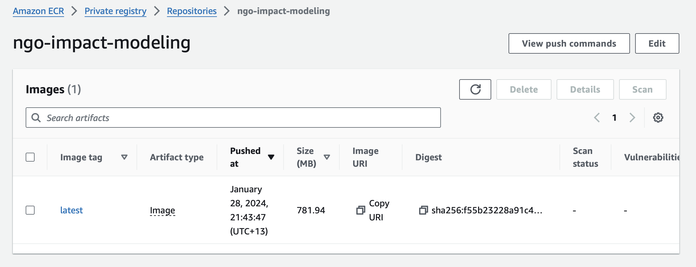
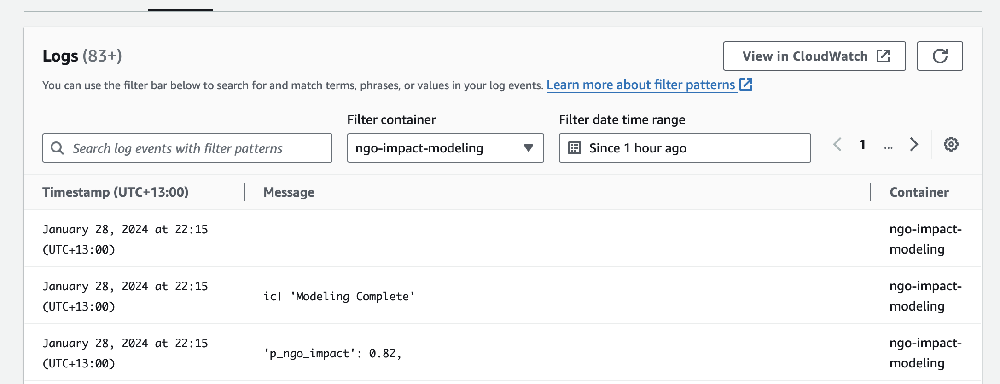
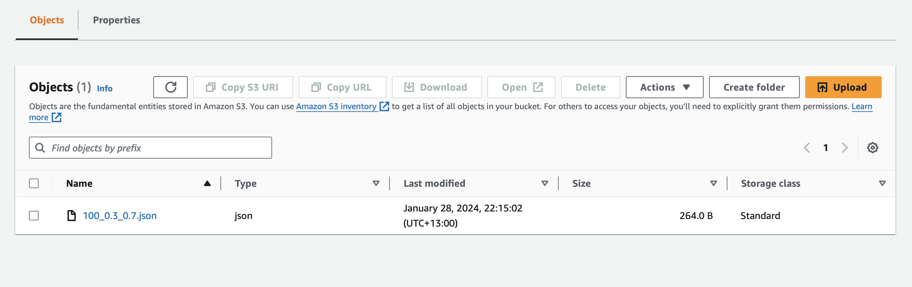

# Are NGOs Able to Increase Voter Turnout?

## Table of Contents

- [Features](#features)
- [Overview](#overview)
- [Setup](#setup)
- [Built With](#built-with)
- [Results](#results)
- [Challenges](#challenges-and-reflections)
- [Contact](#contact)

## Features

- Bayesian inference
- Automated container deployment to AWS Elastic Container Registry
- Automated logging of model results to an AWS S3 Bucket

## Overview

This project was a proposal for a non-profit organization that wanted to measure how effective they were at encouraging people to vote. Given data on the voters history before and after interacting with the organization, Bayesian inference was use to measure how much more likely an individual was to vote after interacting with the organization. To quantify time effects, a parallel analysis on a random sample of people may be performed. The relative trends between the random sample and the people who interacted with the NGO gives insight to how effective their methods are.

Since this project was simply a proof of concept, two key considerations were made. First, synthetic data was used to demonstrate the validity of the techniques and for rapid prototyping. Second, the code is containerized so that it may run on any hardware as scaled as necessary. The current implementation leverages Github Actions to build the container and send to AWS to be run with the Fargate service where results are saved to an S3 bucket.

## Setup

To run the basic analysis

1. Install Docker if needed
2. Clone the repository
3. Navigate to the root directory of the project and run

```bash
docker-compose up
```

To run the unit tests

1. Install Docker if needed
2. Clone the repository
3. Navigate to the root directory of the project and run

```bash
docker-compose -f docker-compose.test.yaml up
```

## Built With

- **AWS**: Handle compute at scale with a serverless container setup
  - Elastic Container Registry
  - Fargate
  - S3
- **Docker**: Containerization of the code
- **Github Actions**: Automatically push container image to AWS
- **Python**: Handle I/O and orchestration
  - Cmdstanpy
  - Numpy
  - Pytest
- **Stan**: Perform Hamiltonian Monte Carlo

## Results

To test the model, the synthetic data was generated assuming the probability of voting before interacting with the NGO at 30% --- the model estimated this quantity at 26%. Similarly, the probability of voting after interacting with the NGO was set at 70% and estimated at 75%. This suggests an increase voters are 50% more likely to vote after interacting with the charity with an 80% probability of the effects validity.

## Pipeline

Github actions run unit tests then build the image and upload it to AWS Elastic Container Registry if sucessful.




The image is run on AWS Fargate and the results are uploaded to an S3 bucket.




The modeling results are stored for later use.

```json
{
    "effect_size": 0.39999999999999997,
    "nrow": 100,
    "with_ngo": {
        "prob_voting": 0.745375,
        "lower_quantile": 0.0084875,
        "upper_quantile": 0.9975125
    },
    "without_ngo": {
        "prob_voting": 0.255125,
        "lower_quantile": 0.00225,
        "upper_quantile": 0.99125
    },
    "p_ngo_impact": 0.82
}
```

## Challenges and Reflections

I was approached to help out with this project as a potential consulting job, so I spent the weekend developing a quick prototype to try out some new ideas. Specifically, I have been studying AWS in preparation for my CCP exam. I wanted to use some of the services I had been reading about, so I thought building a pipeline from Github to AWS would be fun. It was surprisingly easy, and I was happy with the work overall. Well, until I got an email telling my AWS expenses were over budget. Turns out, Elastic Container Registry charges for storage. Time to read up on AWS Budgets :)

## Contact

- [LinkedIn](https://linkedin.com/in/bear-jordan)
